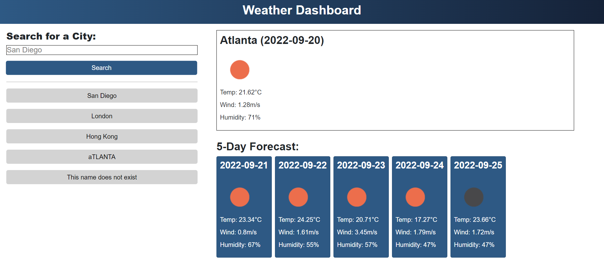

# Module 6 challenge Webpage

## Description

This Module 6 Challenge was created to complete the Module 6 Challenge of the bootcamp.

This project was made to build a weather forecasting web application using the OpenWeather API. Users can type the city name
in the search box to begin the search, and search results will be saved as gray buttons below the search box everytime after
the user performed a search. The weather of the searched city for today and the forecast for the next 5 days will then be
shown on the right side of the webpage, seperated into two parts.

HTML, CSS and JavaScript, jQuery and Bootstrap were used to make this webpage.

## Installation

N/A

## Usage

Link to the deployed website: https://wongpakho814.github.io/module-6-challenge/

## Credits

N/A

## License

N/A
